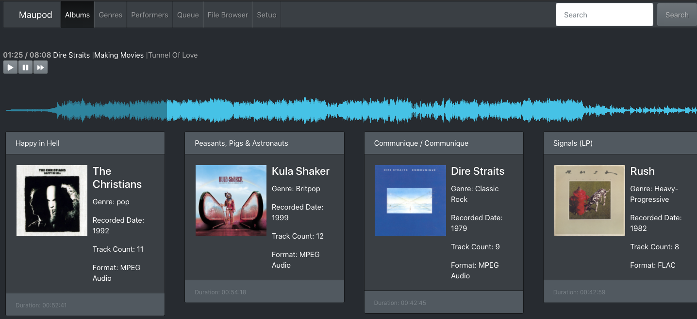
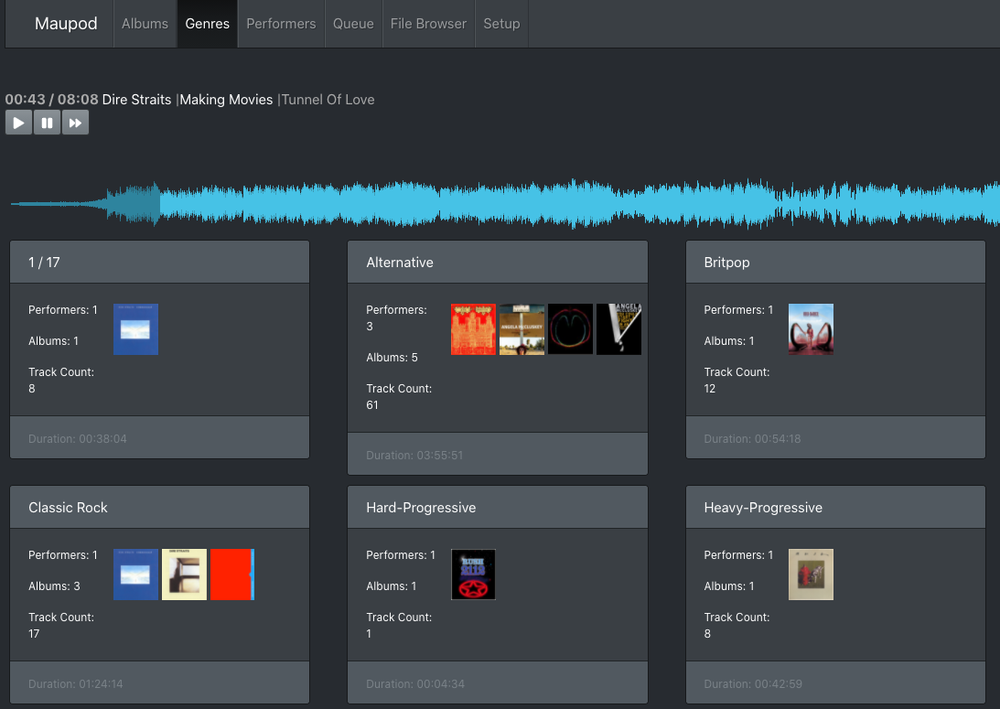
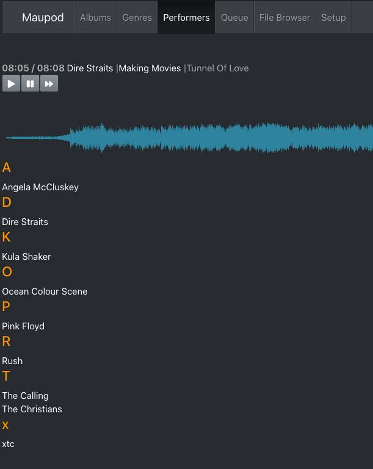
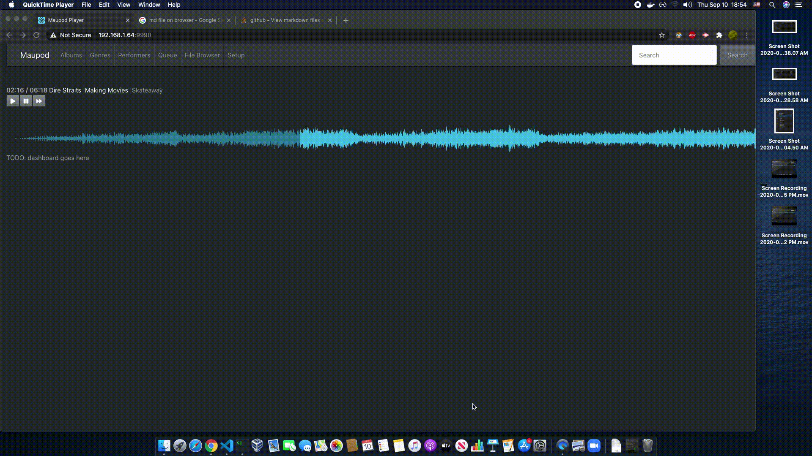
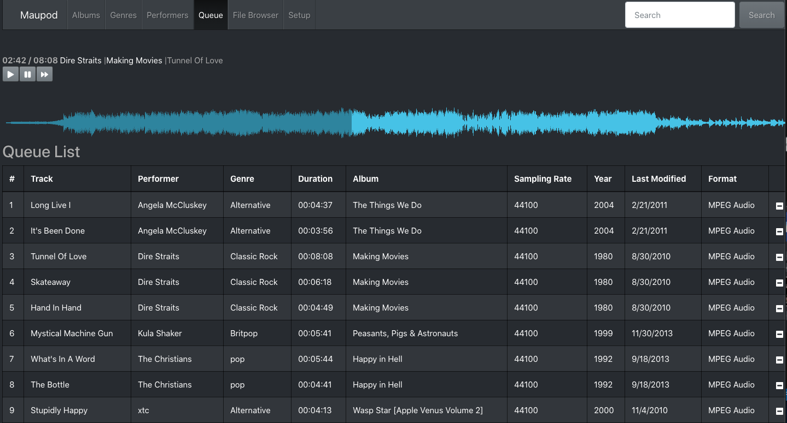
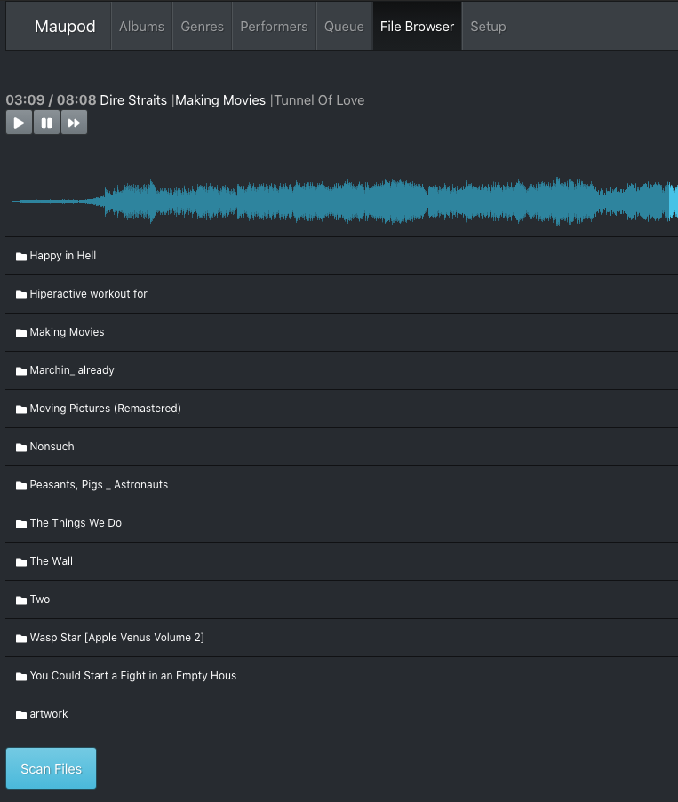

## Maupod Documentation
### Navigation Bar
1. [Dashboard](dashboard)
2. [Albums](albums)
3. [Generes](generes)
4. [Performers](performers)
5. [Queue](queue)
6. [File Browser](file-browser)
7. [Setup](#setup)
8. [Search](#search)
9. [Extra](#extra)

## 1. Dashboard

## 2. Albums

## 3. Generes

## 4. Performers

NOTE: `Music Timeline` and `Control Buttons` only appears if there's a song playing, either on `Queue` or on `Album Page`

1. Artists will appear separated and grouped alphabetically.

2. Each artist name is clickable, and will open it's albums on `Dasboard`.
3. Recently opened albums will disappear from `Dashboard` when navigating out of it.

## 5. Queue

## 6. File Browser

## <a name="setup">7. Setup</a>

## 8. Search

## 9. Extra

