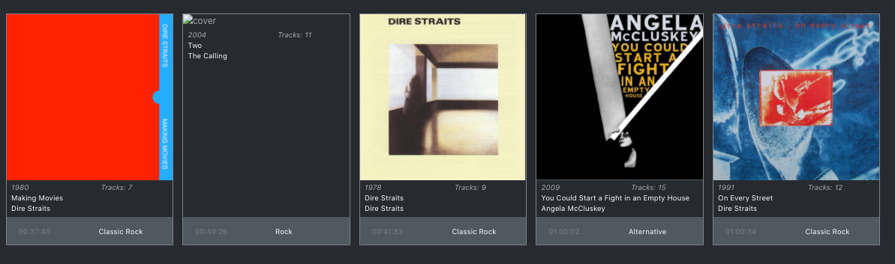

## Maupod Users Guide Documentation

### A. General Specifications

1. Valid `Audio File` **extensions**: `MPEG Audio` (*`MP3`*), `MPEG-4`, `M4A` and `FLAC` (*`Free Lossless Audio Codec`*).
2. <a name="format-images"> Valid formats for Artwork images</a>: `JPEG` (*`JPG`*) and `PNG`.
3. Valid **size** for Artwork images: minimum `500x500px` (`height` and `whith` **must be equal sizes**; and that same image will be resized by `Maupod` for `Albums` and `Generes` display). 

### B. Player Controls

1. `Timer` (minutes. seconds).
2. `Performer` (clickable name of the artist that takes you to the artist's all albums album page).
3. `Album` (clickable name of the album that takes you to that albums individual page).
4. `Paly`, `Pause`, `Skip` (buttones).
5. Track Progress `Spectrum` (clickable `Spectrum Image` wich shows track playing progress and allows jumping forward or backwards on the same track, multiple times).

### C. Navigation Bar

1. [Dashboard](#dashboard)
2. [Albums](#albums)
    * 2.1. [Albums Library](#albums-library)
    * 2.2. [Album View](#album-view)
        * 2.2.1. [Cover Section](#cover-section)
        * 2.2.2. [Track List](#track-list)
    * 2.3. [Upload Album Cover from Album View](#upload-cover)
        * 2.3.1. [Adding Missing Cover from Album View](#addcover-albumview)
        * 2.3.2 [Replacing Album Cover from Album View](#replacecover-albumview)
3. [Generes](#generes)
4. [Performers](#performers)
5. [Queue](#queue)
6. [File Browser](#file-browser)
7. [Setup](#setup)
8. [Search](#search)
9. [Extra](#extra)

## <a name="dashboard">1. Dashboard</a>

NOTE: `Music Timeline` and `Control Buttons` only appears if there's a song playing, either on `Queue` or on `Album Page`.

## <a name="albums">2. Albums</a>

You can have a `General Display` of the `Maupod's Albums Library` or you can open an especific `Album` by clicking it's name and opening it's `Individual Display` page.

### <a name="albums-library">2.1. Albums Library General Display</a>

The information display on the `Album List` for each `Album` is:

1. Name of the `Album` (clickable, and takes you to the album's individual page).
2. Name of the `Performer` (clickable, and takes you to the artist's all albums page).
3. `Genere` (clickable, and takes you to that genere's all performers page).
4. `Recorded Date` (year). 
5. `Tracks` (number).
6. `Format` (audio file extension).
7. `Duration` (hours, minutes, seconds).
8. `Artwork` (album cover).

### <a name="album-view">2.2. Album View (Individual Display Page)</a>

The information display on the `Album` individual page is:

#### <a name="cover-section">2.2.1. Cover Section</a>

1. `Artwork` (`Album` cover).
2. `Album` (clickable, and takes you to the album's individual page).
3. `Performer` (clickable, and takes you to the artist's all albums page).
4. `Genere` (clickable, and takes you to that genere's all performers page).
5. `Duration` (hours, minutes, seconds).
6. `Year` (album's release yaer).
7. `Sampling Rate` (number).
8. `Format` (`AudioFile` extension).

#### <a name="track-list">2.2.2. Track List</a>

1. `Track Number` (number).
2. `Track` (`Audio Control` **buttons** and `Track` name).
  * `Audio Control` **buttons**:
    * `Play` (click and the `Track` will be played right away).
    * `Play Next` (click and the `Track` will be added on to the `Queue List`, to be played next).
    * `Play Later` (click and the `Track` will be added on to the `Queue List`, to be played later, meaning it goes to the end of the list).
3. `Duration` (hours, minutes, seconds).
4. `Format` (`Audio File` extension).

### <a name="upload-cover">2.3. Upload Album Cover from Album View</a>

Maupod allows searching on Internet for the `Album Artwork` by using `https://www.discogs.com/developers`.

You can add a missing `Album` cover or replace it.

#### <a name="addcover-albumview">2.3.1. Adding Missing Cover from Album View</a>

You can add a missing `Album Artwork` directly from the `Album View` by clicking the empty space were `Album` cover should be.

1. Click the album's name with missing cover on `Albums Library` in order to open the `Album View`.
2.3.2. Click the empty space of the cover section.

3. If `Discogs.com` finds a match for the `Album Artwork`, it will show one or more results for you to choose.

**NOTE**: *If the `Album` doesn't have it's original name (and nothing else), the search will be unsuccessful*.

4. Click the album cover that you find more suitable and 3 things will happen:

* A. Maupod will make a copy and add it to the `Arwork` folder.
* B. The new album cover will be displayed.

* C. If the choosen album cover doesn't have a size of **500x500 px** or more, an error mesagge will pop out and the cover won't be added at all.

* D. If there are no results for the album's cover search, a message will pop up alerting that provider didn't found any matches.

If either, steps `C` or `D` are positive, then it will be necesarry to find the `Album Artwork` somwhere else and add it directly to the album's folder with a file sized **500x500 px** minimum and named `cover.jpg` or `cover.png`.

#### <a name="replacecover-albumview">2.3.2. Replacing Album Cover from Album View</a>

In order to replace an Album's Artwork you need to:

1. Go to `Albums Library` and click the album's name.
2. Click the album's `Artwork` and `Discogs.com` will search for other album covers and you will see one or more results.

**NOTE**: *If the `Album` doesn't have it's original name (and nothing else), the search will be unsuccessful*.

NOTE: `Music Timeline` and `Control Buttons` only appears if there's a song playing, either on `Queue` or on `Album Page`.

## <a name="generes">3. Generes</a>

The information display for each `Genere` is:

1. `Name` of the `Genere` (clickable, and takes you to the album's group page within that `Genere`).
2. `Performers` (total number of artists within that `Genere`).
3. `Albums` (total number of `Albums` within that `Genere`).
4. `Track Count` (total number of tracks within that `Genere`).
5. `Duration` (total amount in hours, minutes, seconds of music within that `Genere`).
6. `Artwork` (covers for all `Albums` within that `Genere`).

NOTE: `Music Timeline` and `Control Buttons` only appears if there's a song playing, either on `Queue` or on `Album Page`.

## <a name="performers">4. Performers</a>

1. Artists will appear separated and grouped alphabetically.

2. Each artist name is clickable, and will open it's albums on `Albums Page`.
3. Recently opened albums will disappear from `Albums Page` when navigating out of it.

NOTE: `Music Timeline` and `Control Buttons` only appears if there's a song playing, either on `Queue` or on `Album Page`.

## <a name="queue">5. Queue</a>

The `Queue List` displays the next information:

1. `Number of Track` (number that the track occupies on the list).
2. `Track` (song name).
3. `Performer` (clickable, and takes you to the artist's all albums page).
4. `Genere` (clickable, and takes you to that genere's all performers page).
5. `Duration` (hours, minutes, seconds).
6. `Album` (Clickable album's name, and takes you to that album's individual page).
7. `Sampling Rate` (number).
8. `Year` (of the `Album`).
9. `Last Modified` (day, month, year).
10. `Format` (audio file extension).
11. `Remove Track From Queue` (clickable icon that removes a particular track from the `Queue List`).

NOTE: `Music Timeline` and `Control Buttons` only appears if there's a song playing, either on `Queue`, `Search`or `Album View`.

## <a name="file-browser">6. File Browser</a>

`Setup` adds albums and artwork to **Maupos's Albums library**.

`Setup` will show all music files on the device, but any music file must be sacned first with `Scan Files` **button** in order to be included on **Maupod's Albums library**.

The `Audio File` and `Artwork` scan can be:
1. Individual `Audio / Artwork` Scan.
2. Group `Audio / Artwork` Scan.
3. Only `Artwork` Scan.

### 1. Individual Scan

In order to perform an `Individual Scan` from an especific `Album`, you need to:

1. Click the album's name on the list, and that album's indivudual page will be open.
2. Click `Scan files` **button**.
3. That album `Audio files` and `Artwork` will be added to the **Maupod's Albums Library**.
4. Click `File Browser` on `Navbar` in order to select another album for it's individual scanning.

### 2. Group Scan

In order to perform a `Group Scan` from all abailable `Albums` on the computer or device, you need to:

1. Click `Scan files` **button** at the bottom of the list and `Maupod` will add all `audio Files` to the `Albums lLibrary`, with it's correspondent `Artwork` images (see [Valid formats for Artwork images](#format-images)).

### 3. Only `Artwork` Scan

If you need to add a missing cover or change one, `Maupod` allows to scan `Artwork` apart from the `Audio files`.

You need to add the new `Artwork` cover on the `Audio File` folder.

In order to perform an `Only Artwork Scan`, you need to:

1. Click `artwork` at the bottom of the list.

2. The `Artwork` scan page will open. Then, click `Scan files` **button**.
3. `Maupod` will scan new `artwork` added to `Audio Files` folders available on the computer or device. 

NOTE: `Music Timeline` and `Control Buttons` only appears if there's a song playing, either on `Queue` or on `Album Page`.

## <a name="setup">7. Setup</a>

`Maupod` keeps track on the users music playing record in order to create `Playlists` and keep count of `Most played Songs`; thus, allowing the user to `Export` or `Import` his favorite music playing record from one computer or device to another.

The `Events` added on this `Track Record` are:

* When a track is skipped.
* When a track has been completely played.

That `Track Record` text file can be:

1. `Exported`.
2. `Imported`.

### 1. Exporting Events

* `Maupod` creats a `.txt` file that can be exported by clicking the `Export Events` **button**.
* A window will open to choose`name` and `where` you want to save the `.txt` file.
* by defaoult, the `.txt` file has the name `events+[date-of-creation]+code`.

### 2. Importing Events

Any `Events` text file generated in `Maupod` can be imported into other cumputer or divices.

`Maupod` assigns specific codes for `Tracks`, `Performers` and `Albums`, so they can be recognized by the application on different computers or devices, regardlees of whether they were present at the time of the importing, or added later on.

To `Import` an `Events List`:
* Click the `Choose File` **button**. The explorer window will be opened to allown the selecting of the `.txt` file.
* Select file and click `Open`
* After file has been chosen, click on the `Import Events` **button**.
* A message will open on another window in the browser:

NOTE: `Music Timeline` and `Control Buttons` only appears if there's a song playing, either on `Queue` or on `Album Page`.

## <a name="search">8. Search</a>

`Maupod` allows to search by:
- `Performer`.
- `Album`.
- `Track Name`.
- `Genere`.

After any `Query` is performed, all results are presented on a list, that includes:

1. `Album Artwork` (cover).
2. `Track Number` (track number on the `Query` list).
3. `Track` (`Audio Control` **buttons** and `Track` name).
  * `Audio Control` **buttons** include:
    * `Play` (click and the `Track` will be played right away).
    * `Play Next` (click and the `Track` will be added on to the `Queue List`, to be played next).
    * `Play Later` (click and the `Track` will be added on to the `Queue List`, to be played later, meaning it goes to the end of the list).
4. `Performer` (clickable, and takes you to the artist's all albums page).
5. `Genere` (clickable, and takes you to that genere's all performers page).
6. `Duration` (hours, minutes, seconds).
7. `Album` (Clickable album's name, and takes you to that album's individual page).
8. `Sampling Rate` (number).
9. `Year` (of the `Album`).
10. `Last Modified` (day, month, year).
11. `Format` (`Audio File` extension).

## <a name="extra">9. Extra</a>

